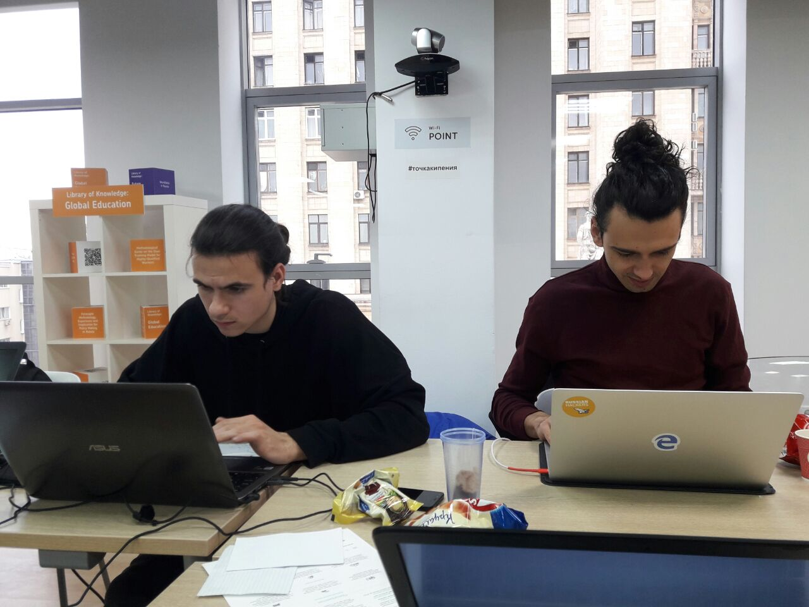
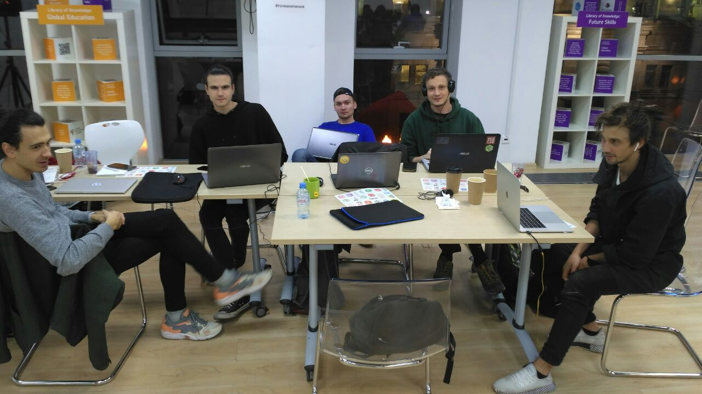

# React Native hackathon 🚀

React Native client for 

[Space Apps Challenge | 2018](https://2018.spaceappschallenge.org/)

The app idea is to efficiently and fast determine wildfires and notify nearby people.

You can see all the wildfires aggregated from NASA satelites API aswell as add you own with pictures and geodata. Each picture is checking with neural net assigning confidence percentage. In case you are just uploading selfie 

## Functionality

- Display aggregated data with polygons on map
- Show user current location
- Put point on map and display form
- Send user location, point location and image to server
- Get response and display new polygon

## Folder Structure

Elements - UI kit for application containing all the buttons, inputs, text styles etc

Layouts - Layouts containing common elements for different user states e.g. authorized non authorized layout

Pages - Top level page components

Redux - Folder containing modules for state each module contain:

  ModuleName - Folder named by reducer e.g User

      index.js - entry file where all exports take place

      UserReducer.js - reducer with redux-actions & Immutable.js

      import { handleActions, createAction } from 'redux-actions' import Immutable from 'seamless-immutable'

      // --- // CONSTANTS // --- export const SET_ACTIVE_ORDER = 'trade/SET_ACTIVE_ORDER'

      // --- // ACTION CREATORS // ---

      export const setActiveOrder = createAction(SET_ACTIVE_ORDER)

      // --- // INITIAL STATE // ---

      const initialState = Immutable({ activeOrder: null })

      // --- // REDUCER // ---

      export default handleActions( { [SET_ACTIVE_ORDER]: (state, action) => Immutable.merge(state, { activeOrder: action.payload }) }, initialState )

  This structure is strict
      UserSelectors.js - selectors for redux using all mapStateToProps goes with selectors

  reactjs/reselect
      UserSagas.js - sagas for sideeffects

  redux-saga/redux-saga

modules - Folder containing all the reusable container and components each folder has it's own module name e.g. User
  User - folder containing user's related components and containers, which are not screens
      components - folder containing all components
      containers - folder containing all the containers
Utils - utils folder

## Demo
using expo

**P.S. Just some **pics****

